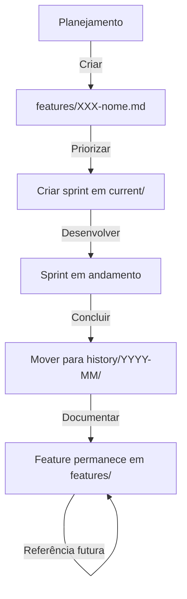

# 📋 Guia de Organização de Sprints

> Documentação do fluxo de trabalho para gerenciamento de sprints e features no projeto SGTI-GAC.

**Última atualização:** 2026-02-14
**Status:** Ativo

---

## 🎯 Estrutura de Diretórios

```
.aidev/plans/
├── features/          → Documentação PERMANENTE de features
├── current/           → Sprint ativa (apenas 1 por vez)
├── history/YYYY-MM/   → Sprints concluídas (organizadas por mês)
├── archive/           → Sprints antigas (formato legado, sprints 1-8)
├── backlog/           → Funcionalidades planejadas para futuro
└── ROADMAP.md         → Documento mestre de planejamento
```

---

## 📐 Fluxo de Trabalho

### 1️⃣ Planejamento de Feature

Quando uma nova funcionalidade é planejada:

```bash
# 1. Criar documentação detalhada da feature
.aidev/plans/features/XXX-nome-da-feature.md

# 2. Registrar no ROADMAP
.aidev/plans/ROADMAP.md
```

**Importante:**
- Features ficam **permanentemente** em `features/`
- Nunca são removidas ou movidas
- Servem como documentação técnica de referência

---

### 2️⃣ Início de Sprint

Quando uma sprint é iniciada:

```bash
# 1. Criar arquivo de sprint em current/
.aidev/plans/current/sprint-N-nome-descritivo.md

# 2. Atualizar current/README.md com status "em andamento"

# 3. Atualizar ROADMAP.md marcando sprint como ativa
```

**Conteúdo do arquivo de sprint:**
- Status (🔄 Em Andamento)
- Datas de início e conclusão prevista
- Referência à feature relacionada
- Checklist técnico detalhado
- Progresso por fase

---

### 3️⃣ Conclusão de Sprint

Quando uma sprint é concluída:

```bash
# 1. Atualizar status da sprint para ✅ CONCLUÍDA
vim .aidev/plans/current/sprint-N-nome.md

# 2. Mover sprint para history/YYYY-MM/
mv .aidev/plans/current/sprint-N-nome.md \
   .aidev/plans/history/2026-02/

# 3. Atualizar current/README.md (limpar sprint ativa)

# 4. Atualizar history/README.md (adicionar nova entrada)

# 5. Atualizar archive/README.md (atualizar contadores)

# 6. Atualizar features/README.md (marcar feature como concluída)

# 7. Atualizar ROADMAP.md (marcar sprint como ✅ CONCLUÍDA)
```

**IMPORTANTE:**
- A **feature** permanece em `features/` (nunca é movida)
- Apenas o **arquivo de sprint** é movido para `history/`

---

## ✅ Exemplo Prático (Sprints 9 e 10)

### Sprint 9 - Unificação de Identidade

```bash
# Feature (PERMANECE)
.aidev/plans/features/007-user-unification-expansion.md

# Sprint (MOVIDA)
.aidev/plans/history/2026-02/sprint-9-user-unification.md
```

### Sprint 10 - Interface Admin/Users

```bash
# Feature (PERMANECE)
.aidev/plans/features/008-admin-users-unified-interface.md

# Sprint (MOVIDA)
.aidev/plans/history/2026-02/sprint-10-admin-users-interface.md
```

---

## 📊 Status Atual (14/02/2026)

| Localização | Conteúdo | Quantidade |
|-------------|----------|------------|
| `features/` | Features 007, 008 (documentação permanente) | 2 |
| `current/` | Nenhuma sprint ativa | 0 |
| `history/2026-02/` | Sprints 9, 10 (concluídas) | 2 |
| `archive/` | Sprints 1-8 (formato legado) | 8 |
| **TOTAL** | 10 sprints concluídas | 10 |

---

## 🔄 Ciclo de Vida de uma Feature



---

## 📋 Checklist de Conclusão de Sprint

- [ ] Atualizar status da sprint para ✅ CONCLUÍDA
- [ ] Mover sprint de `current/` para `history/YYYY-MM/`
- [ ] Atualizar `current/README.md`
- [ ] Atualizar `history/README.md`
- [ ] Atualizar `archive/README.md` (contadores)
- [ ] Atualizar `features/README.md` (status da feature)
- [ ] Atualizar `ROADMAP.md` (marcar sprint concluída)
- [ ] Verificar que feature permanece em `features/`

---

## 🎯 Boas Práticas

### ✅ Fazer:
- Manter features em `features/` permanentemente
- Mover sprints concluídas para `history/YYYY-MM/`
- Atualizar todos os READMEs após conclusão
- Organizar sprints por mês em `history/`

### ❌ Não Fazer:
- Mover ou remover features de `features/`
- Deixar sprints antigas em `current/`
- Misturar sprints de meses diferentes
- Esquecer de atualizar ROADMAP

---

## 📚 Documentos Relacionados

- [ROADMAP.md](ROADMAP.md) - Planejamento mestre
- [features/README.md](features/README.md) - Índice de features
- [current/README.md](current/README.md) - Sprint ativa
- [history/README.md](history/README.md) - Histórico cronológico
- [archive/README.md](archive/README.md) - Sprints antigas

---

*Este documento foi criado em 14/02/2026 para padronizar o fluxo de organização de sprints após a conclusão das Sprints 9 e 10.*
