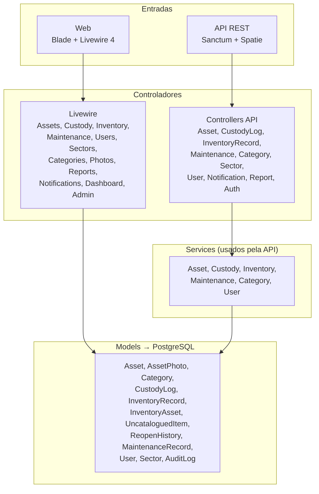
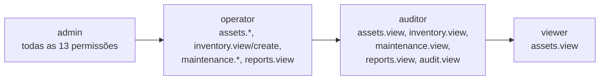
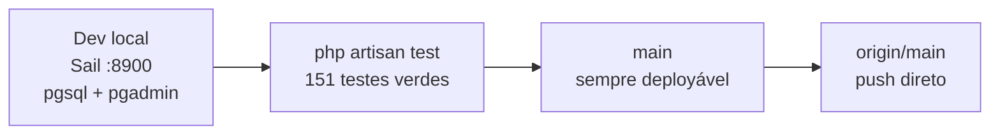

# Mapa do Projeto — SGTI-GAC

> Grafo de alinhamento: quem conversa com quem, quem pode o quê, como a entrega anda. Tudo abaixo foi levantado do código — sem peça decorativa.

## 1. Módulos e dependências

Leitura: a Web reativa fala direto com os Models; a API passa por Services. Regra nova entra em Services (padrão em [METODOLOGIA](./METODOLOGIA.md)).

## 2. Papéis e permissões (Spatie, guard `web`)

Conjunto real de permissões (`RolesAndPermissionsSeeder`): `assets.view/create/edit/delete`, `inventory.view/create/approve`, `maintenance.view/create/edit`, `reports.view`, `users.manage`, `audit.view`.

## 3. Ambientes e entrega

Convenções: [METODOLOGIA](./METODOLOGIA.md) · Setup: [INSTALL.md](../INSTALL.md) · API: [API.md](./API.md) · Arquitetura: [ARCHITECTURE.md](./ARCHITECTURE.md)